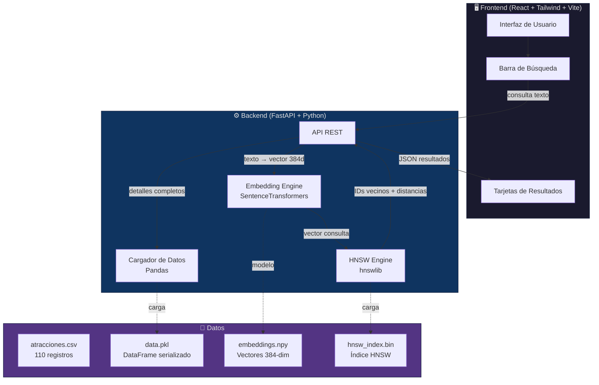

<div align="center">

# 🌿 AmazoníaSearch

### Implementación de un Índice HNSW para Búsqueda Semántica de Atractivos Turísticos en Puerto Maldonado

[](https://python.org)
[](https://fastapi.tiangolo.com)
[](https://reactjs.org)
[](LICENSE)

*Proyecto académico para el curso de **Estructura de Datos y Algoritmos Avanzado***

[Comenzar](#-instalación) · [Guía de Demo](GUIADE_DEMO.md) · [Informe IEEE](article/INFORME_IEEE.md) · [API](#-documentación-de-la-api)

</div>

---

## 📋 Descripción

**AmazoníaSearch** es un buscador semántico inteligente de atractivos turísticos de Puerto Maldonado, Madre de Dios, Perú. A diferencia de un buscador tradicional que busca coincidencias exactas de palabras clave, este sistema **comprende el significado y contexto** de las consultas del usuario.

Por ejemplo, si un usuario busca *"un lugar tranquilo para ver aves en la selva"*, el sistema sugerirá el **Lago Sandoval** o la **Reserva Ecológica Taricaya**, aunque sus descripciones no contengan explícitamente esas palabras exactas.

El motor de búsqueda utiliza la estructura de datos **HNSW (Hierarchical Navigable Small World)**, un grafo jerárquico de proximidad que permite encontrar los vecinos más cercanos en un espacio vectorial de alta dimensionalidad con complejidad **O(log N)**, resolviendo la *maldición de la dimensionalidad* que afecta a estructuras clásicas como KD-Trees.

### 🎯 Contexto Académico

Este proyecto fue desarrollado como trabajo final de investigación para el curso de **Estructura de Datos y Algoritmos Avanzado**, siguiendo los lineamientos del artículo científico:

> Malkov, Y. A., & Yashunin, D. A. (2018). *Efficient and robust approximate nearest neighbor search using Hierarchical Navigable Small World graphs*. IEEE Transactions on Pattern Analysis and Machine Intelligence.

---

## 📸 Capturas de Pantalla

<div align="center">

| Interfaz Principal | Resultados de Búsqueda |
|:---:|:---:|
| *[Captura de la interfaz principal]* | *[Captura de resultados con tarjetas]* |

| Gráficos de Experimentos | API Docs |
|:---:|:---:|
| *[Captura de gráficos benchmark]* | *[Captura de /docs de FastAPI]* |

</div>

> 💡 **Nota:** Ejecuta el proyecto y captura tus propias pantallas para reemplazar estos marcadores.

---

## ✨ Características

- 🔍 **Búsqueda Semántica:** Comprende el significado de las consultas, no solo palabras clave.
- ⚡ **Alta Velocidad:** Búsquedas en microsegundos gracias al índice HNSW.
- 🌐 **Soporte Multilingüe:** Modelo de embeddings multilingüe (español, inglés, portugués y más).
- 📊 **110 Atractivos Turísticos:** Dataset completo de Puerto Maldonado con descripciones detalladas.
- 🎨 **Interfaz Moderna:** SPA responsiva construida con React y Tailwind CSS.
- 📈 **Métricas de Similitud:** Muestra el porcentaje de similitud semántica de cada resultado.
- 🧪 **Benchmark Integrado:** Scripts para evaluar rendimiento y precisión del índice.
- 📄 **API REST Documentada:** Endpoints documentados automáticamente con Swagger/OpenAPI.

---

## 🏗️ Arquitectura del Sistema



### Flujo de Búsqueda

1. El usuario escribe una consulta en lenguaje natural (ej: *"cascada oculta en la selva"*).
2. El **Frontend** envía la consulta al endpoint `/api/search` del backend.
3. El **Embedding Engine** transforma el texto en un vector de 384 dimensiones usando SentenceTransformers.
4. El **HNSW Engine** busca los K vecinos más cercanos al vector de consulta en el índice.
5. El **Backend** recupera los datos completos de los atractivos encontrados del DataFrame en memoria.
6. El **Frontend** muestra los resultados como tarjetas ordenadas por porcentaje de similitud.

---

## 🛠️ Stack Tecnológico

| Componente | Tecnología | Versión | Propósito |
|:---|:---|:---:|:---|
| **Lenguaje Backend** | Python | 3.12 | Lógica de negocio y API |
| **Framework API** | FastAPI | 0.115+ | Endpoints REST con documentación automática |
| **Modelo de Embeddings** | SentenceTransformers | latest | Modelo `paraphrase-multilingual-MiniLM-L12-v2` |
| **Índice Vectorial** | hnswlib | latest | Implementación eficiente de HNSW en C++ |
| **Datos** | Pandas / NumPy | latest | Manipulación de datos y vectores |
| **Frontend** | React | 18 | Interfaz de usuario como SPA |
| **Estilos** | Tailwind CSS | 3 | Framework de utilidades CSS |
| **Bundler** | Vite | latest | Empaquetador rápido para desarrollo |
| **Iconos** | Lucide React | latest | Iconos SVG modernos |

### Parámetros del Índice HNSW

| Parámetro | Valor | Descripción |
|:---|:---:|:---|
| `M` | 16 | Número máximo de conexiones por nodo por capa |
| `ef_construction` | 200 | Tamaño de la lista de candidatos durante la construcción |
| `ef_search` | 50 | Tamaño de la lista de candidatos durante la búsqueda |
| `space` | cosine | Métrica de distancia (Similitud de Coseno) |
| `dim` | 384 | Dimensionalidad de los vectores de embeddings |

---

## 📋 Prerrequisitos

Antes de comenzar, asegúrate de tener instalado:

- **Python** 3.10 o superior → [Descargar](https://python.org/downloads/)
- **Node.js** 18 o superior → [Descargar](https://nodejs.org/)
- **Git** → [Descargar](https://git-scm.com/)

Verifica las instalaciones:

```bash
python --version    # Python 3.10+
node --version      # v18+
npm --version       # 9+
git --version       # 2.x+
```

---

## 🚀 Instalación

### 1. Clonar el Repositorio

```bash
git clone https://github.com/ValerioGomez/amazonian-search.git
cd amazonian-search
```

### 2. Configurar el Backend

```bash
# Crear y activar el entorno virtual
python -m venv venv

# Windows (PowerShell)
.\venv\Scripts\Activate.ps1

# Windows (CMD)
.\venv\Scripts\activate.bat

# Linux / macOS
source venv/bin/activate

# Instalar dependencias
pip install -r backend/requirements.txt
```

### 3. Generar los Datos

Este paso descarga el modelo de IA, genera los embeddings vectoriales y construye el índice HNSW:

```bash
python -m backend.scripts.generate_data
```

> ⏱️ **Nota:** La primera ejecución puede tardar unos minutos mientras descarga el modelo de ~500 MB.

### 4. Iniciar el Backend

```bash
uvicorn backend.api.main:app --reload --port 8000
```

El servidor estará disponible en: **http://localhost:8000**

Documentación interactiva de la API: **http://localhost:8000/docs**

### 5. Configurar e Iniciar el Frontend

En una **nueva terminal**:

```bash
cd frontend
npm install
npm run dev
```

La aplicación estará disponible en: **http://localhost:5173**

---

## 📡 Documentación de la API

### Endpoints Disponibles

| Método | Ruta | Descripción | Parámetros |
|:---:|:---|:---|:---|
| `GET` | `/` | Verificación de estado del servidor | — |
| `GET` | `/api/search` | Búsqueda semántica de atractivos | `q` (string), `k` (int, default=5) |
| `GET` | `/api/attractions` | Listar todos los atractivos turísticos | — |
| `GET` | `/api/attractions/{id}` | Obtener un atractivo por su ID | `id` (int) |
| `GET` | `/api/stats` | Estadísticas del índice HNSW | — |

### Ejemplos de Uso

#### Búsqueda Semántica

```bash
# Buscar lugares tranquilos para observación de aves
curl "http://localhost:8000/api/search?q=lugar+tranquilo+para+ver+aves+en+la+selva&k=5"
```

**Respuesta esperada:**

```json
{
  "query": "lugar tranquilo para ver aves en la selva",
  "results": [
    {
      "id": 1,
      "nombre": "Lago Sandoval",
      "categoria": "Reserva Natural",
      "descripcion": "Hermoso lago de herradura en la selva amazónica...",
      "similitud": 0.87
    }
  ],
  "time_ms": 2.3
}
```

#### Consultas de Ejemplo

| Consulta | Resultados Esperados |
|:---|:---|
| *"lugar tranquilo para ver aves en la selva"* | Lago Sandoval, Collpa de Guacamayos Chuncho |
| *"alojamiento ecológico con vista al lago"* | Inkaterra Hacienda Concepción, Corto Maltes Lodge |
| *"aventura en la selva amazónica"* | Pasarela de Dosel de Taricaya, Quebrada Gamitana |
| *"comida típica y artesanía local"* | Mercado Central, Comunidad Nativa Infierno |
| *"monos y animales rescatados"* | Isla de los Monos, Amazon Shelter |

---

## 🧠 ¿Cómo funciona HNSW?

**HNSW (Hierarchical Navigable Small World)** es una estructura de datos basada en grafos para la búsqueda aproximada de vecinos más cercanos (ANN). Fue propuesta por Malkov y Yashunin en 2018.

### Idea Fundamental

Imagina una ciudad con múltiples niveles de carreteras:

- **Capa superior (autopistas):** Pocas conexiones de largo alcance que te llevan rápidamente a la zona correcta.
- **Capas intermedias:** Conexiones de alcance medio para afinar la dirección.
- **Capa inferior (calles locales):** Muchas conexiones de corto alcance para encontrar la ubicación exacta.

### Estructura del Grafo

```
Capa 2 (pocas conexiones):    A ─────────────────── D
                               │                     │
Capa 1 (más conexiones):      A ──── B ──── C ──── D ──── E
                               │     │      │      │      │
Capa 0 (todas las conexiones): A ─ B ─ C ─ D ─ E ─ F ─ G ─ H
```

### Algoritmo de Búsqueda

1. **Entrada:** Comienza en un nodo arbitrario de la capa más alta.
2. **Búsqueda codiciosa (*greedy search*):** En cada capa, navega hacia el vecino más cercano a la consulta.
3. **Descenso:** Cuando no puede mejorar en la capa actual, baja a la capa inferior.
4. **Resultado:** En la capa 0, retorna los K vecinos más cercanos encontrados.

### Complejidad

| Operación | Complejidad |
|:---|:---|
| Búsqueda | O(log N) |
| Inserción | O(log N) |
| Memoria | O(N · M) |

> 📖 **Referencia:** Malkov, Y. A., & Yashunin, D. A. (2018). *Efficient and robust approximate nearest neighbor search using Hierarchical Navigable Small World graphs*. IEEE TPAMI, 42(4), 824-836.

---

## 📊 Resultados Experimentales

### Experimento 1: Variación del Parámetro M

Se evaluó el impacto del parámetro `M` (número máximo de conexiones por nodo) en el rendimiento del índice:

| M | Tiempo de Construcción | Tiempo de Búsqueda | Recall@10 | Memoria |
|:---:|:---:|:---:|:---:|:---:|
| 4 | Más rápido | Más rápido | Menor | Menor |
| 8 | Rápido | Rápido | Medio | Medio |
| **16** | **Moderado** | **Moderado** | **Alto** | **Moderado** |
| 32 | Lento | Lento | Muy alto | Alto |
| 64 | Muy lento | Muy lento | Máximo | Muy alto |

> Los gráficos detallados se generan ejecutando `python -m backend.scripts.benchmark` y se guardan en `backend/data/`.

### Experimento 2: Recall vs. Velocidad

El parámetro `ef_search` controla el trade-off entre precisión y velocidad:

- **ef_search bajo (10-20):** Búsquedas ultrarrápidas pero con menor recall.
- **ef_search medio (50):** Balance óptimo entre velocidad y precisión *(configuración elegida)*.
- **ef_search alto (200+):** Recall casi perfecto pero búsquedas más lentas.

---

## 📁 Estructura del Proyecto

```
amazonian-search/
├── 📂 backend/
│   ├── 📂 api/
│   │   ├── main.py               # Aplicación FastAPI (endpoints y lógica principal)
│   │   ├── embedding_engine.py   # Motor de embeddings (SentenceTransformers)
│   │   └── hnsw_engine.py        # Motor HNSW (hnswlib)
│   ├── 📂 data/
│   │   ├── atracciones.csv       # Dataset original (110 atractivos)
│   │   ├── data.pkl              # DataFrame serializado
│   │   ├── embeddings.npy        # Vectores de embeddings (110 × 384)
│   │   ├── hnsw_index.bin        # Índice HNSW serializado
│   │   └── *.png                 # Gráficos de experimentos
│   ├── 📂 scripts/
│   │   ├── generate_data.py      # Genera embeddings e índice HNSW
│   │   ├── check_files.py        # Verifica la integridad de los datos
│   │   ├── test_api.py           # Tests de la API
│   │   └── benchmark.py          # Benchmark y experimentos
│   ├── requirements.txt          # Dependencias de Python
│   └── .env                      # Variables de entorno
├── 📂 frontend/
│   ├── 📂 src/
│   │   ├── 📂 components/        # Componentes React
│   │   ├── App.jsx               # Componente principal
│   │   ├── index.css             # Estilos globales (Tailwind)
│   │   └── main.jsx              # Punto de entrada
│   ├── package.json              # Dependencias de Node.js
│   └── vite.config.js            # Configuración de Vite
├── 📂 article/
│   ├── INFORME_IEEE.md           # Informe de investigación (formato IEEE)
│   └── *.md                      # Artículo de referencia
├── README.md                     # ← Estás aquí
├── GUIADE_DEMO.md                # Guía paso a paso para la demostración
└── .gitignore                    # Archivos ignorados por Git
```

---

## 👥 Autores

| Nombre | Rol | Contacto |
|:---|:---|:---|
| *[Nombre del Alumno 1]* | Desarrollo Backend & HNSW | *[correo@universidad.edu]* |
| *[Nombre del Alumno 2]* | Desarrollo Frontend & UI | *[correo@universidad.edu]* |

**Curso:** Estructura de Datos y Algoritmos Avanzado  
**Universidad:** *[Nombre de la Universidad]*  
**Semestre:** *[Semestre Académico]*  
**Docente:** *[Nombre del Docente]*

---

## 📄 Licencia

Este proyecto está bajo la Licencia MIT. Consulta el archivo [LICENSE](LICENSE) para más detalles.

```
MIT License

Copyright (c) 2026 AmazoníaSearch

Se concede permiso, de forma gratuita, a cualquier persona que obtenga una copia
de este software y los archivos de documentación asociados, para utilizar el
Software sin restricción, incluyendo sin limitación los derechos de usar, copiar,
modificar, fusionar, publicar, distribuir, sublicenciar y/o vender copias del
Software, sujeto a las siguientes condiciones:

El aviso de copyright anterior y este aviso de permiso se incluirán en todas las
copias o partes sustanciales del Software.
```

---

## 📚 Referencias

1. Malkov, Y. A., & Yashunin, D. A. (2018). **Efficient and robust approximate nearest neighbor search using Hierarchical Navigable Small World graphs**. *IEEE Transactions on Pattern Analysis and Machine Intelligence*, 42(4), 824-836. [DOI: 10.1109/TPAMI.2018.2889473](https://doi.org/10.1109/TPAMI.2018.2889473)

2. Reimers, N., & Gurevych, I. (2019). **Sentence-BERT: Sentence Embeddings using Siamese BERT-Networks**. *Proceedings of the 2019 Conference on Empirical Methods in Natural Language Processing (EMNLP)*.

3. Mikolov, T., et al. (2013). **Efficient Estimation of Word Representations in Vector Space**. *arXiv preprint arXiv:1301.3781*.

4. Documentación oficial de [hnswlib](https://github.com/nmslib/hnswlib) — Implementación en C++/Python del algoritmo HNSW.

5. Documentación oficial de [SentenceTransformers](https://www.sbert.net/) — Framework para embeddings de oraciones.

---

<div align="center">

Hecho con 💚 en la Amazonía peruana

*AmazoníaSearch — Buscando con inteligencia en la selva de datos*

</div>
